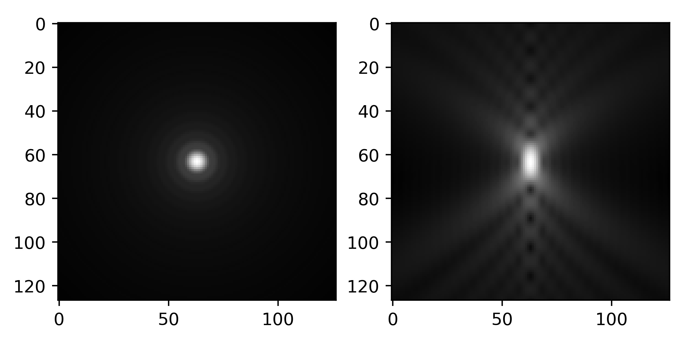

# PSFmodels-py

Python bindings for scalar and vectorial models of the point spread function.

Original C++ code and MATLAB MEX bindings Copyright &copy; 2006-2013, [Francois Aguet](http://www.francoisaguet.net/software.html), distributed under GPL-3.0 license.
Python bindings by Talley Lambert

The model is described in Auget et al 2009<sup>1</sup>. For more information and implementation details, see Francois' Thesis<sup>2</sup>.

<sup>1</sup> [F. Aguet et al., (2009) Opt. Express 17(8), pp. 6829-6848](https://doi.org/10.1364/OE.17.006829)

<sup>2</sup> [F. Aguet. (2009) Super-Resolution Fluorescence Microscopy Based on Physical Models. Swiss Federal Institute of Technology Lausanne, EPFL Thesis no. 4418](http://bigwww.epfl.ch/publications/aguet0903.html)

### see also:

For a different (faster) scalar-based Gibson–Lanni PSF model, see the [MicroscPSF](https://github.com/MicroscPSF) project, based on [Li et al (2017)](https://doi.org/10.1364/JOSAA.34.001029) which has been implemented in [Python](https://github.com/MicroscPSF/MicroscPSF-Py), [MATLAB](https://github.com/MicroscPSF/MicroscPSF-Matlab), and [ImageJ/Java](https://github.com/MicroscPSF/MicroscPSF-ImageJ)

## Install

Prebuilt binaries available on pypi for OS X and Windows, sdist available for linux

```
pip install psfmodels
```

### from source

(requires cmake and a c++ compiler)

```
git clone https://github.com/tlambert03/PSFmodels-py.git
cd PSFmodels-py
python setup.py install
```

## Usage

There are two main functions in `vectorialpsf`: `make_psf` and `make_centered_psf`. The main difference is that `make_psf` accepts a vector of Z positions `zvec` (relative to coverslip) at which PSF is calculated. As such, the point source may or may not actually be in the center of the rendered volume. `make_centered_psf`, by contrast, does _not_ accecpt `zvec`, but rather accepts `nz` (the number of z planes) and `dz` (the z step size in microns), and always generates an output volume in which the point source is positioned in the middle of the Z range, with planes equidistant from each other. Both functions accept an argument `zdepth`, specifying the position of the point source relative to the coverslip. See all keyword arguments below

_Note, all output dimensions (`nx` and `nz`) should be odd._

```python
import psfmodels as psfm
import matplotlib.pyplot as plt
from matplotlib.colors import PowerNorm

# generate centered psf with a point source at `pz` from coverslip
nx = 127
nz = nx
dxy = 0.05
psf = psfm.vectorial_psf_centered(nz=nz, nx=nx, dxy=dxy, dz=dxy, pz=0)
fig, (ax1, ax2) = plt.subplots(1, 2)
ax1.imshow(psf[nz//2], norm=PowerNorm(gamma=0.4))
ax2.imshow(psf[:, nx//2], norm=PowerNorm(gamma=0.4))
plt.show()
```



```python
# instead of nz and dz, you can directly specify a vector of z positions
import numpy as np

# generate 31 evenly spaced Z positions from -3 to 3 microns
zvec = np.linspace(-3, 3, 31)
psf = psfm.vectorial_psf(zvec, nx=127)
psf.shape  # (31, 127, 127)
```

**all** PSF functions accept the following parameters. In general, units should be provided in microns. Python API may change slightly in the future.  See function docstrings as well.

```
nx (int):       XY size of output PSF in pixels, must be odd.
dxy (float):    pixel size in sample space (microns) [default: 0.05]
pz (float):     depth of point source relative to coverslip (in microns) [default: 0]
ti0 (float):    working distance of the objective (microns) [default: 1.515]
ni0 (float):    immersion medium refractive index, design value [default: 1.515]
ni (float):     immersion medium refractive index, experimental value [default: 1.515]
tg0 (float):    coverslip thickness, design value (microns) [default: 170]
tg (float):     coverslip thickness, experimental value (microns) [default: 170]
ng0 (float):    coverslip refractive index, design value [default: 1.515]
ng (float):     coverslip refractive index, experimental value [default: 1.515]
ns (float):     sample refractive index [default: 1.47]
wvl (float):    emission wavelength (microns) [default: 0.6]
NA (float):     numerical aperture [default: 1.4]
sf (int):       oversampling factor to approximate pixel integration [default: 3]
mode (int):     if 0, returns oversampled PSF [default: 1]
```

## Comparison with other models

While these models are definitely slower than the one implemented in [Li et al (2017)](https://doi.org/10.1364/JOSAA.34.001029) and [MicroscPSF](https://github.com/MicroscPSF), there are some interesting differences between the scalar and vectorial approximations, particularly with higher NA lenses, non-ideal sample refractive index, and increasing spherical aberration with depth from the coverslip.

For an interactive comparison, see the [examples.ipynb](examples.ipynb) Jupyter notebook.
